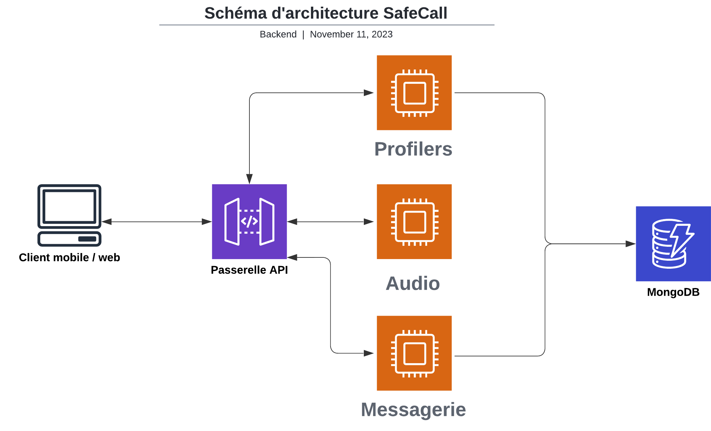

SafeCall est mon projet de fin d'études que je partage avec 6 autres étudiants. C'est le projet qui valide notre diplôme, il dure 2 ans et demi et on développe notre projet de la conceptualisation à un lancement en condition réelles avec EPITECH.

# Concept

Nous avions remarqué au début du projet que les arnaques téléphoniques étaient un vrai problème pour une grande partie de la population. Nous nous sommes penchés sur l'origine du problème, la fuite des numéros de téléphones et nous avons identifié un point clé : s'inscrire avec un numéro de téléphone.

C'était la source de tous les problèmes potentiels, mais il y avait en parallèle de ça un autre souci, les numéros de téléphone mis en ligne dans des annonces de particulier à particulier, sur des sites comme LeBonCoin par exemple.

Notre objectif a donc été de palier à ces 2 failles : l'inscription avec son numéro de téléphone pour prouver que l'utilisateur n'est pas un robot, et permettre aux utilisateurs de communiquer entre eux dans un environnement maîtrisé avec notre application SafeCall.

# Mon rôle sur le projet

J'ai eu plusieurs rôles sur le projet, déjà celui d'architecte du serveur. Je me suis beaucoup documenté et j'ai mis au point une architecture fonctionnelle pour notre serveur en prenant soin de respecter les contraintes de chacun. J'ai finalement choisi de faire des microservices pour que chacun ait le choix de la technologie avec il est le plus à l'aise, et ça facilite le travail en groupe, mais ça reporte la difficulté sur le déploiement du projet.

J'ai pris le soin de développé la passerelle API qui servait les applications web & mobile, et qui redirige leurs requêtes vers la partie du serveur correspondant. Je me suis également chargé d'un autre microservice, qui lui s'occupe exclusivement des informations utilisateurs : leur agenda, leur profile, leurs contacts...

Dans les deux cas, j'ai développé en Golang, car c'est une technologie avec laquelle j'avais envie de développer mes compétences, tout en étant un langage totalement viable pour ce projet-là. En ce qui concerne le stockage des données, j'ai choisi mongoDB avec Atlas pour la facilité d'utilisation.

Il y a aussi un microservice qui s'occupe de la logique liée aux messages texte et un autre lié à la messagerie audio.

Je me suis occupé du déploiement de A à Z, avec Docker et Microsoft Azure et le forfait qu'EPITECH nous fournit. J'ai fait en sorte qu'à chaque publication de code sur la branche main, un container avec le nouveau code se met en place avec les workflows de Github. Et sur la machine virtuelle que j'ai configurée préalablement, il a suffi d'installer docker, d'avoir les autorisations nécessaires pour télécharger les packages, et le code était déployé.

Comme il y a plusieurs microservices et donc plusieurs containers, j'ai dû utiliser un réseau de conteneur Docker pour les faire communiquer les uns avec les autres sans passé par Internet pour éviter les failles potentielles.

# Sources

Vous pouvez retrouver SafeCall sur son site vitrine à l'adresse, et vous pouvez également télécharger l'APK de l'application sur le site : [SafeCall](https://eip.epitech.eu/2024/safecall/) 
